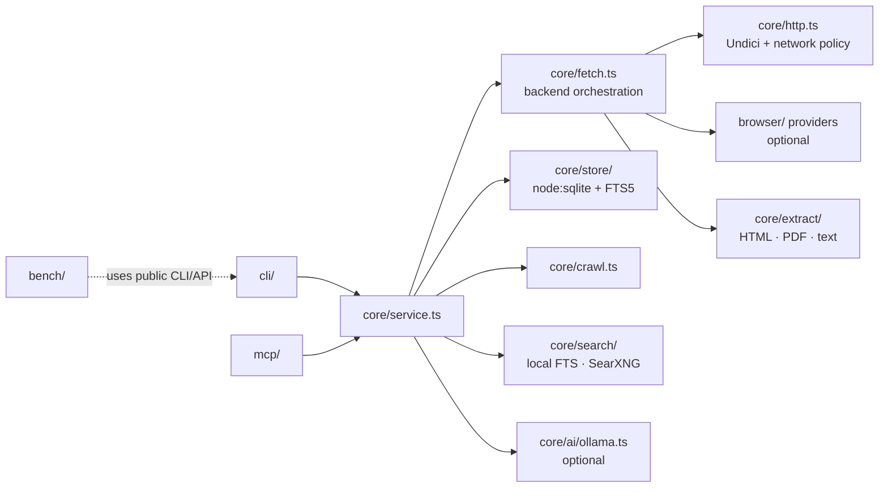

# Architecture

Fetchkeep is a single Node.js package with a browser-free core and thin adapters.

## Layout

| Path | Responsibility |
|---|---|
| `src/core/schema.ts` | Zod schemas for documents, blocks, citations and the response envelope. |
| `src/core/netpolicy.ts` | Address classification, allow-lists, DNS-pinned lookup for Undici. |
| `src/core/http.ts` | HTTP client: manual redirects, deadlines, compressed/decompressed size limits, charset decoding. |
| `src/core/extract/` | HTML (Readability + structural), Markdown (Turndown + GFM), blocks, PDF (PDF.js), plain text. |
| `src/core/fetch.ts` | Backend selection (`http`, `auto`, `chromium`, `lightpanda`), escalation heuristic, attempt log, shared deadline. |
| `src/core/store/` | SQLite schema, documents/versions/blocks/snapshots, FTS5 search, export, retention, workspaces. |
| `src/core/crawl.ts` | Bounded crawler with robots.txt, sitemaps, pacing, resume. |
| `src/core/search/` | Local search and the optional web search provider interface (SearXNG). |
| `src/core/ai/` | Optional Ollama schema extraction with evidence checking. |
| `src/core/service.ts` | The façade shared by CLI and MCP; returns envelopes. |
| `src/browser/` | `BrowserProvider` interface, pool, Playwright/Chromium and Puppeteer/Lightpanda adapters. |
| `src/cli/`, `src/mcp/` | Argument parsing / MCP tool registration only. |
| `bench/` | Engine-neutral benchmark runner, fixtures, adapters, reports. Not shipped in the npm package. |

## Decisions

### ADR-1 Runtime: Node.js ≥ 22.19 (LTS), ESM, TypeScript strict
Node 22 and 24 are current LTS lines. 22.19 is the minimum required by Undici 8. TypeScript runs in `strict`
mode with `noUncheckedIndexedAccess`. Compiled with `tsc`; no bundler.

### ADR-2 Storage: built-in `node:sqlite` with FTS5
`node:sqlite` ships with Node (SQLite 3.5x, FTS5 enabled), so installation needs no native compilation or
prebuilt binaries. This keeps `npm install fetchkeep` browser-free and toolchain-free on every OS.
Trade-off: the module is still marked "release candidate" in Node 22/24 and may print an experimental warning on
Node 22; the store wraps it behind a small interface so a switch to `better-sqlite3` stays local.

### ADR-3 HTML parsing: linkedom (no scripting)
`linkedom` builds a DOM without executing scripts or loading subresources, is fast and small, and is compatible
with `@mozilla/readability` and Turndown. `jsdom` is heavier and was not needed. Fetched scripts are never
executed by the core; JavaScript runs only inside an optional, separately installed browser process.

### ADR-4 Extraction: Readability *or* structural, chosen per page
Readability is excellent on articles but can drop tables, code and navigation-organised documentation. The
extractor runs both and keeps Readability's output only when it retains most of the structural text and does not
lose tables or code blocks; otherwise it uses a structural main-content extractor (`main`/`article`/`[role=main]`,
boilerplate stripping). The chosen strategy is reported as `strategy`.

GFM rules (tables, strikethrough, task lists, fenced code with language) are implemented as Turndown rules in
`src/core/extract/markdown.ts`: the published GFM plugins depend on DOM APIs linkedom lacks (`HTMLTableElement.rows`,
CSSOM) and silently flatten tables to text.

### ADR-5 Blocks are the unit of citation
Extracted content is split into ordered blocks (heading, paragraph, list, table, code, quote). The document
Markdown is exactly the blocks joined with blank lines, so every block has a stable character offset. Citations
use `fk:<docId>@<version>#<blockId>` and carry the block hash, source URL and fetch time. Identical extracted
Markdown never creates a new version.

### ADR-6 Network policy at the socket, not only the URL
The Undici dispatcher uses a custom `lookup` that resolves, filters and pins addresses, so redirects and DNS
rebinding are covered. IP-literal hosts are checked before connecting. Browser subrequests are checked in the
request-interception hook of each browser adapter (see `docs/security.md` for the remaining browser DNS gap).

### ADR-7 Browsers are optional peers behind one interface
`BrowserProvider` exposes `render(request) → {finalUrl, status, html, …}` and `close()`; no Playwright or
Puppeteer types leak. `playwright-core` and `puppeteer-core` are optional peer dependencies loaded with dynamic
`import()` only when a browser backend is configured. Fetchkeep never downloads browsers itself.

### ADR-8 One deadline, recorded attempts
Every request gets a single `AbortSignal` deadline. `auto` mode tries HTTP first and escalates only when the
heuristic flags the result as incomplete or JavaScript is explicitly required; every attempt (backend, outcome,
duration, reason) is recorded in the envelope.

### ADR-9 Envelope first
CLI `--json` and MCP return the same envelope (`src/core/schema.ts`). MCP puts it in `structuredContent` and a
text rendering in `content`, with fetched text wrapped in explicit untrusted-content delimiters.

### ADR-10 Benchmark lives in-repo but outside the package
`bench/` is excluded from the npm tarball. Competitors are driven through their public CLI/HTTP interfaces and
installed separately; the benchmark never embeds their code.
